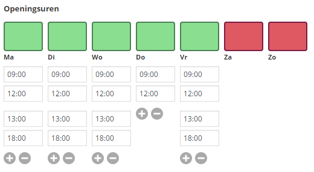

Advanced Custom Fields: Business hours Field
============================================
ACF field to edit business hours

|                   |                                           |
|-------------------|-------------------------------------------|
| Contributors      | Igor Kalders                              |
| Tags              | jQuery, ACF                               |
| Requires at least | 4.0                                       |
| Tested up to      | 4.6                                       |
| Stable tag        | master                                    |
| License           | GPLv2 or later                            |
| License URI       | http://www.gnu.org/licenses/gpl-2.0.html  |

Description
-----------

With this ACF extension you can edit business hours in a user friendly way.

This plugin is based on a fork of the
[ACF Field Type Template](https://github.com/elliotcondon/acf-field-type-template)
combined with an adapted version of the clever
[Business Hours plugin for jQuery](https://github.com/gEndelf/jquery.businessHours)
, topped off with a litte
[jQuery TimePicker](http://jonthornton.github.com/jquery-timepicker/).

The result looks like this:

For now, there's no front end UI.

### Compatibility

This ACF field type is compatible with:
* ACF 4

Installation
------------

1. Copy the `acf-businesshours` folder into your `wp-content/plugins` folder
2. Activate the Business hours plugin via the plugins admin page
3. Create a new field via ACF and select the Business hours type
4. Please refer to the description for more info regarding the field type settings

### Changelog

#### 1.0.0
* Initial Release.